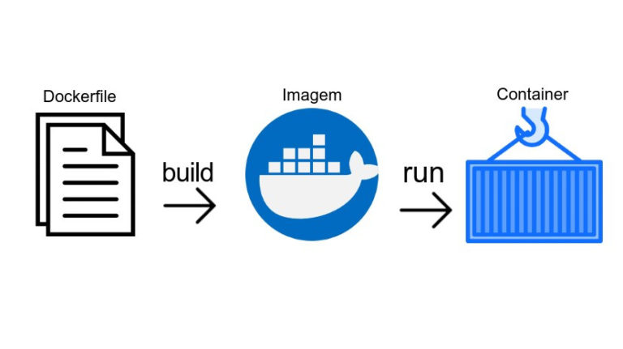

# Dockerfile
Passo a passo de como construir sua própria imagem docker

## Montando um container

Criando um container com base em uma imagem já existente:

`docker run -p 8080:3000 -v "$(pwd):/var/www" -w "/var/www" node npm start`

## Montando o Dockerfile

Geralmente, montamos as nossas imagens a partir de uma imagem já existente. Nós podemos criar uma imagem do zero, mas a prática de utilizar uma imagem como base e adicionar nela o que quisermos é mais comum. Para dizer a imagem-base que queremos, utilizamos a palavra FROM mais o nome da imagem.

`FROM node`

Além disso, podemos indicar a versão da imagem que queremos, ou utilizar o latest, que faz referência à versão mais recente da imagem. Se não passarmos versão nenhuma, o Docker irá assumir que queremos o latest, mas vamos deixar isso explícito:

`FROM node:latest`

Outra instrução que é comum colocarmos é quem cuida, quem criou a imagem, através do MAINTAINER:

`FROM node:latest`  
`MAINTAINER Lucas Lira`

Agora, especificamos o que queremos na imagem. No caso, queremos colocar o nosso código dentro da imagem, então utilizarmos o COPY. Como queremos copiar tudo o que está dentro da pasta, vamos utilizar o . para copiar tudo que está na pasta do arquivo Dockerfile, e vamos copiar para /var/www, do exemplo da aula anterior:

`FROM node:latest`  
`MAINTAINER Lucas Lira`  
`COPY . /var/www`

No projeto, já temos as suas dependências dentro da pasta node_modules, mas não queremos copiar essa pasta para dentro do container, pois elas podem estar desatualizadas, quebradas, então queremos que a própria imagem instale as dependências para nós, rodando o comando npm install. Para executar um comando, utilizamos o RUN:

`FROM node:latest`  
`MAINTAINER Lucas Lira`  
`COPY . /var/www`  
`RUN npm install`  

Agora, deletamos a pasta node_modules, para ela não ser copiada para o container. Além disso, toda imagem possui um comando que é executado quando a mesma inicia, e o comando que utilizamos na aula anterior foi o npm start. Para isso, utilizamos o ENTRYPOINT, que executará o comando que quisermos assim que o container for carregado:

`FROM node:latest`  
`MAINTAINER Lucas Lira`  
`COPY . /var/www`  
`RUN npm install`  
`ENTRYPOINT npm start`  

Também podemos passar o comando como se fosse em um array, por exemplo ["npm", "start"], ambos funcionam.

Falta colocarmos a porta em que a aplicação executará, a porta em que ela ficará exposta. Para isso, utilizamos o EXPOSE:

`FROM node:latest`  
`MAINTAINER Lucas Lira`  
`COPY . /var/www`  
`RUN npm install`  
`ENTRYPOINT ["npm", "start"]`  
`EXPOSE 3000`  

Por fim, falta dizermos onde os comandos rodarão, pois eles devem ser executados dentro da pasta /var/www. Então, através do WORKDIR, assim que copiarmos o projeto, dizemos em qual diretório iremos trabalhar;

`FROM node:latest`  
`MAINTAINER Lucas Lira`  
`COPY . /var/www`  
`WORKDIR /var/www`  
`RUN npm install`
`ENTRYPOINT npm start`  
`EXPOSE 3000`

## Criando a imagem

Para criar a imagem, precisamos fazer o seu build através do comando docker build, comando utilizado para buildar uma imagem a partir de um Dockerfile. Para configurar esse comando, passamos o nome do Dockerfile através da flag -f:

`docker build -f Dockerfile`

Como o nome do nosso Dockerfile é o padrão, poderíamos omitir esse parâmetro, mas se o nome for diferente, por exemplo node.dockerfile, é preciso especificar, mas vamos deixar especificado para detalharmos melhor o comando.

Além disso, passamos a tag da imagem, o seu nome, através da flag -t. Já vimos que para imagens não-oficiais, colocamos o nome no padrão **NOME_DO_USUARIO/NOME_DA_IMAGEM**, então é isso que faremos, por exemplo:

`docker build -f Dockerfile -t lucaslira/node`

E agora dizemos onde está o Dockerfile. Como já estamos rodando o comando dentro da pasta volume-exemplo, vamos utilizar o ponto (.);

`docker build -f Dockerfile -t douglasq/node .`

## Criando um container a partir da nossa imagem

Agora que já temos a imagem criada, podemos criar um container a partir dela:

`docker run -d -p 8080:3000 lucaslira/node`